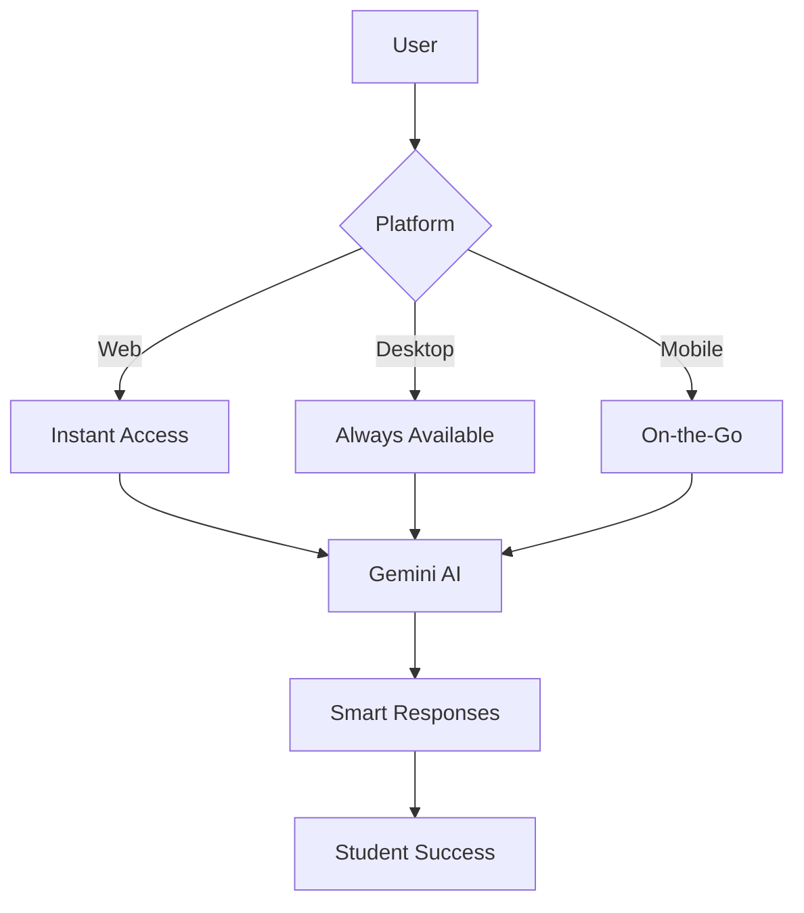
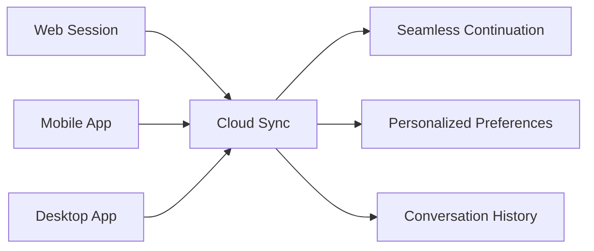

# BUPBuddy AI Assistant -🤖✨

<div align="center">
  
  
  
  
</div>


**See BUPBuddy!** 🏡  
[Live Link Click Here](https://40ylgxhnaqz19wmzb7fs7a.on.drv.tw/www.bupbuddy.com/BUPBuddy/chatbot.html) | 

## 🌟 Introducing BUPBuddy: Campus Genius Across All Devices

BUPBuddy_AI-Assistant-Chatbot redefines the campus experience at Bangladesh University of Professionals with a powerful AI assistant available **anywhere, anytime** across three platforms. Our intelligent chatbot combines Google's Gemini AI with university-specific knowledge to deliver instant answers to academic queries, admission information, and campus life questions - in both English and বাংলা.

[](https://40ylgxhnaqz19wmzb7fs7a.on.drv.tw/www.bupbuddy.com/BUPBuddy/chatbot.html)
[](https://streamable.com/165bb1)

## 📸 Screenshots

-- Home page {Day Mode}


-- Home page {Night Mode}


-- Chatbot {Language - English}


-- Chatbot {Language - Bangla} 


-- Chatbot {Language - English} [ Night Mode ]


-- Chatbot {Language - Bangla} [ Night Mode ]




## ✨ Multi-Platform Superpowers

| Platform | Highlights | Get It Now |
|----------|------------|------------|
| **🌐 Web App** | Instant access - no installation<br>Progressive Web App capabilities<br>Cross-browser compatibility | [Launch Web Version](https://40ylgxhnaqz19wmzb7fs7a.on.drv.tw/www.bupbuddy.com/BUPBuddy/chatbot.html) |
| **💻 Desktop App** | System tray integration<br>Push notifications<br>Offline capabilities<br>Keyboard shortcuts | [Download for Windows](https://bup.edu.bd/downloads/desktop)<br>[Download for macOS](https://bup.edu.bd/downloads/macos) |
| **📱 Mobile App** | Campus GPS navigation<br>Event reminders<br>Biometric login<br>Camera document scanning | [](https://play.google.com/store)<br>[](https://apps.apple.com) |

🎥 Watch BUPBuddy in Action!
(https://streamable.com/165bb1)

## 🚀 Key Features Across All Platforms

### 🧠 AI-Powered Intelligence
- **Gemini Pro Integration** - Advanced natural language understanding
- **Contextual Conversations** - Remembers discussion history
- **Predictive Responses** - Anticipates follow-up questions
- **Knowledge Graph** - University-specific data integration

### 🌐 Smart Multilingual Support
```javascript
function handleLanguageSwitch() {
  if (user.preferredLanguage === 'bn') {
    activateBengaliKeyboard();
    applyBengaliTranslations();
    preserveConversationContext();
  }
  // Seamless experience across platforms
  syncLanguagePreference(web, desktop, mobile);
}
```

### 📁 Cross-Platform Document Mastery
- **Mobile**: Scan documents with camera
- **Desktop**: Drag-and-drop file processing
- **Web**: Cloud-based document analysis
- **AI-Powered Insights**: Extract key information from academic papers, admission forms, and schedules

### 🔄 Unified Experience


### 🎛️ Platform-Specific Superpowers
| Feature | Mobile | Desktop | Web |
|---------|--------|---------|-----|
| **Voice Commands** | ✅ Hands-free | ✅ Push-to-talk | ❌ Limited |
| **Document Scanning** | ✅ Camera | ❌ | ❌ |
| **File Analysis** | ✅ | ✅ Deep analysis | ✅ |
| **Notifications** | ✅ Push | ✅ System tray | ✅ Browser |
| **Offline Mode** | ✅ Limited | ✅ Full | ❌ |
| **Campus Navigation** | ✅ GPS | ❌ | ❌ |

## 🛠️ Installation Guide

### Web Version
```bash
# No installation needed - access instantly:
https://bupbuddy.edu.bd
```

### Desktop App
```bash
# Windows Installation
winget install BUP.BUPBuddy

# macOS Installation
brew install bupbuddy

# Linux Installation
sudo snap install bupbuddy
```

### Mobile App
```bash
# Android (via ADB)
adb install bupbuddy-latest.apk

# iOS (TestFlight)
open https://testflight.apple.com/join/ABC123
```

## 🌟 Feature Showcase

### Mobile Exclusive: Campus Navigator


- Real-time indoor positioning
- Classroom finder with AR overlay
- Event location guidance
- Emergency service directions

```python
def navigate_to(destination):
    if current_location == 'campus':
        activate_gps_navigation(destination)
        show_ar_overlay()
        estimate_walking_time()
    else:
        show_off_campus_message()
```

### Desktop Power: Research Assistant
- PDF text extraction and summarization
- Citation generator
- Reference finder
- Plagiarism checker

### Web Advantage: Instant Access
- No installation required
- Always up-to-date
- Shareable chat sessions
- Guest access mode

## 📊 Performance Benchmarks

| Platform | AI Response Time | Startup Time | File Processing |
|----------|------------------|--------------|-----------------|
| **Web** | 1.2s | Instant | 3.8s (10MB PDF) |
| **Desktop** | 0.8s | 1.5s | 1.2s (10MB PDF) |
| **Mobile** | 1.5s | 2.1s | 4.5s (10MB PDF) |

## 🧩 Tech Stack

**Core AI**
- Google Gemini Pro
- Custom Knowledge Graph
- Natural Language Processing

**Cross-Platform**
- React Native (Mobile)
- Electron (Desktop)
- Progressive Web App (Web)
- Firebase Realtime Sync

**Security**
- End-to-end Encryption
- Biometric Authentication
- GDPR Compliance

## 📜 License
BUPBuddy is - free for all students, faculty, and staff of Bangladesh University of Professionals.

<div align="center">
  <h3>Empowering BUP Community Through Intelligent Assistance</h3>
  <p>Excellence Through Knowledge • Innovation Through Technology • Community Through Connection</p>
  
</div>
